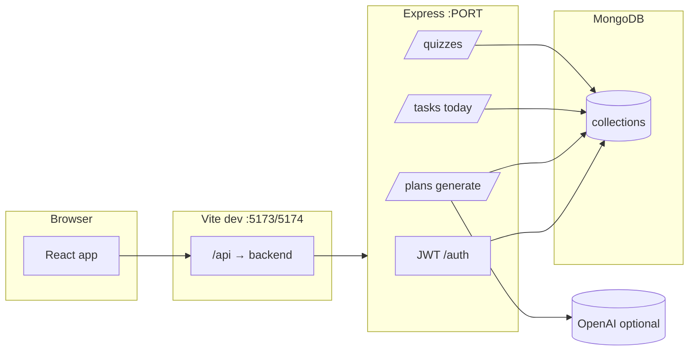

# AI Study Planner (Learnova-Ai)

Full-stack study planner: **React (Vite + TypeScript)** + **Node/Express + MongoDB**, JWT auth, weekly timetables (OpenAI **or** built-in template), **mock tests**, dashboard tasks, progress, PDF export, reminders.

---

## How the app flows (big picture)



### Typical student journey

1. **Register / login** → JWT stored; sidebar shows your name.
2. **Profile** → set exam goal, exam date, daily hours, study preference (used when generating plans).
3. **Plan generator** → pick subjects & weak areas → **Generate**  
   - With a valid **OpenAI** key and quota → AI builds the week.  
   - Without key / quota / on error → **template timetable** (same UI; banner on Timetable explains it).  
   - Creates **WeeklyPlan** + **StudyTask** rows for the week.
4. **Timetable** → view grid; **Download PDF** uses the latest plan id.
5. **Dashboard** → today’s **tasks** from that plan; **Mark done** updates streak.
6. **Mock test** → random MCQs (OpenAI optional; built-in bank always works). **Max 2 finished tests per subject per 7 days.**
7. **Progress / Weak areas / Notifications** → analytics, tips, reminders (cron).

---

## One-time setup

| Requirement | Notes |
|-------------|--------|
| Node.js 18+ | |
| MongoDB | Local `mongodb://127.0.0.1:27017/...` or Atlas URI in `backend/.env` |

From the **repo root**:

```bash
npm run setup
```

Copy env files:

```bash
cp backend/.env.example backend/.env
cp frontend/.env.example frontend/.env
```

### Critical: same port everywhere

- **`backend/.env`** → `PORT` (e.g. `5000` or `5001`).
- **`frontend/.env`** → **`VITE_PROXY_TARGET=http://127.0.0.1:<PORT>`** must match that port.  
  If they differ, you get **404** on `/api/quizzes` and other routes.

---

## Run every day (two terminals)

**Terminal A — API**

```bash
cd backend
npm run dev
# or: npm run dev:nodemon
```

Wait for: `API http://localhost:PORT` and `Quizzes: GET /api/quizzes/health`.

**Terminal B — UI**

```bash
cd frontend
npm run dev
```

Open the URL Vite prints (often **http://localhost:5173**; if busy, **5174**). CORS allows both.

**Root shortcuts** (from repo root, after `setup`):

```bash
npm run dev:api    # backend only
npm run dev:web    # frontend only
```

---

## Quick health checks (no login)

```bash
curl -s http://127.0.0.1:5000/api/health
curl -s http://127.0.0.1:5000/api/quizzes/health
```

Use your real `PORT` if not `5000`.

---

## OpenAI (optional)

| `OPENAI_API_KEY` | Behaviour |
|------------------|-----------|
| Empty / missing | Template **plans** + built-in **quiz** questions only (no bill). |
| Set + working quota | AI plans + AI quiz questions when possible. |
| Set but quota/billing error | **Automatic fallback** to template / built-in (no crash). |

---

## Troubleshooting

| Symptom | Fix |
|---------|-----|
| Quiz / API **404** | Align **`VITE_PROXY_TARGET`** with **`PORT`**. Restart Vite. |
| **EADDRINUSE** on 5000 | `fuser -k 5000/tcp` (Linux) or change `PORT` + proxy. |
| **401** everywhere | Log in again; JWT expired or missing. |
| **CORS** errors | Use Vite **proxy** (`VITE_API_URL=/api`). Backend allows 5173/5174. |
| Mongo **connection failed** | Start `mongod` or fix `MONGODB_URI`. |

---

## API routes (base `/api`)

| Area | Examples |
|------|----------|
| Auth | `POST /auth/register`, `POST /auth/login`, `GET /auth/me` |
| Profile | `PATCH /users/profile` |
| Subjects | `GET/POST/PATCH/DELETE /subjects` |
| Plans | `POST /plans/generate`, `GET /plans/latest`, `GET /plans/:id/pdf`, `GET /plans/weak-insight` |
| Tasks | `GET /tasks/today`, `PATCH /tasks/:id`, `GET /tasks/analytics` |
| Notifications | `GET /notifications`, `PATCH /notifications/all/read` |
| Quizzes | `GET /quizzes/limits`, `POST /quizzes/start`, `POST /quizzes/submit`, `GET /quizzes/history`, `GET /quizzes/profile-stats` |

**Mock tests:** max **2 completed** tests per **subject** per **rolling 7 days**.

---

## MongoDB collections (short)

- **users** — account, streak, preferences  
- **subjects** — per-user subjects, weak flags  
- **weeklyplans** — slots for the week  
- **studytasks** — daily tasks (from plan)  
- **taskhistories** — completion log  
- **notifications** — reminders  
- **quizsessions** — mock test sessions & scores  

---

## Project layout

```
backend/src   → server.js, routes/, controllers/, models/, services/, jobs/
frontend/src  → pages/, layout/, context/, api/client.ts, styles/studyai.css
```

---

## Production

- Strong `JWT_SECRET`, HTTPS, narrow `CLIENT_ORIGIN`.  
- Build UI: `cd frontend && npm run build` → serve `dist/`; point API URL to your server (`VITE_API_URL` at build time if not using same-origin proxy).

## License

MIT (adjust for your portfolio).
